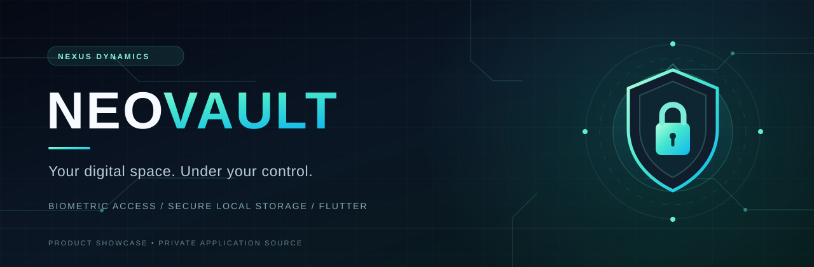
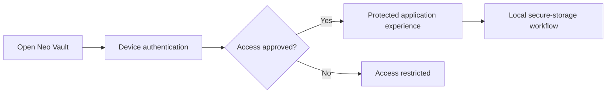

### N E X U S &nbsp; D Y N A M I C S

**A security-focused Flutter experience**

**Product documentation is public. The application implementation remains private.**

---

## Overview

**Neo Vault** is a mobile security and privacy application project in the **Nexus Dynamics** portfolio. The concept focuses on device-based access control, protected local storage, and an intentionally polished security interface.

Rather than expose internal implementation, this repository presents the project's purpose, design direction, and the technologies identified in the supplied Flutter configuration.

> **Project status:** Public product showcase. The full Flutter source, an installable build, independent security audit, and end-to-end functional tests are **not** included in this repository.

## Experience pillars

| Focus | Product direction |
| :--- | :--- |
| **Biometric access** | Explore device-supported authentication as an entry point to sensitive actions. |
| **Sensitive local storage** | Design around protected on-device data storage rather than displaying secrets openly. |
| **Thoughtful security UX** | Use clear feedback, deliberate motion, and easy-to-understand interaction states. |
| **Privacy-conscious design** | Keep sensitive data exposure and unnecessary collection out of the intended experience. |
| **Modern mobile aesthetics** | Combine custom typography, animation, and glass-inspired surfaces. |

These are product goals and relevant technology areas. A dependency being listed does **not** by itself demonstrate that a feature is implemented, secure, or production-ready.

## Technology snapshot

The supplied Flutter project manifest identifies these libraries:

| Layer | Tools and packages |
| :--- | :--- |
| **Application framework** | Flutter · Dart |
| **Device authentication** | `local_auth` |
| **Protected storage** | `flutter_secure_storage` |
| **Typography** | `google_fonts` |
| **Transitions and motion** | `animate_do` |
| **Visual surfaces** | `glassmorphism` |
| **Gesture interaction** | `shake` |
| **Application icon tooling** | `flutter_launcher_icons` |

### Conceptual interaction flow

*Illustration of the intended user experience, not a claim that this complete flow was verified in a running build.*

## Design direction

**PROTECT WHAT MATTERS.  
KEEP CONTROL CLOSE.**

The design language aims to balance an understated dark visual system with purposeful security cues, strong contrast, modern typography, and smooth motion. The intention is to make privacy tools feel both dependable and approachable.

## Security and transparency

Security requires more than a polished interface or the presence of a package in the dependency list. Encryption design, secret handling, biometrics, backup behavior, threat resistance, and platform-specific safeguards must be implemented and tested before any security guarantees can be made.

**No independently verified claim of quantum-resistant encryption, quantum key generation, or audited credential protection is made by this showcase.**

## Product visuals

Real application screenshots and demonstrations may be added to this repository after they are approved for public sharing. The banner above is **brand artwork**, not a screenshot of the running application.

## Public vs private

| Public repository | Private application |
| :--- | :--- |
| Project identity and brand artwork | Dart and Flutter application source |
| Technology overview | Implementation and authentication logic |
| Design and security goals | Secret material, credentials, environment files |
| Approved preview imagery | Internal builds, configurations, and unpublished assets |

The repository's existing license applies to material actually published here. **It does not make unpublished application source code publicly available.**

---

### NEO VAULT

*Security begins with control.*

**A Nexus Dynamics project** · [Developer portfolio](https://github.com/yashransubhe-prog)

